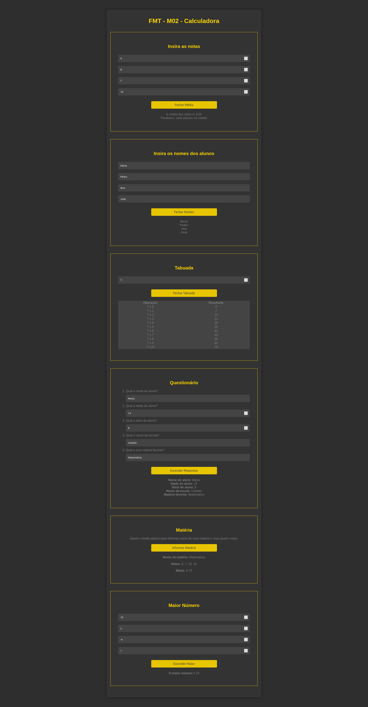

# FMT - LabScore

O LabScore é um pequeno projeto de inputs e outputs para exercitar HTML5, CSS3 e Javascript por meio da criação uma página web interativa que permita aos usuários inserir notas, nomes de alunos, realizar cálculo da média e demonstrar a tabuada de um número escolhido. 

A interface é amigável e responsiva de modo a permitir que os resultados sejam exibidos e oculdados dinamicamente usando Javascript.

## Tecnologias usadas

- HTML5
- CSS3
- Javascript

## Funcionalidades

1. **Inserção de Notas**: O usuário pode inserir quatro notas com valores decimais entre 0 e 10.
2. **Cálculo da Média**: Um botão que, ao ser clicado, calcula a média das notas inseridas e exibe uma mensagem de aprovação ou recuperação com base no resultado. O botão também alterna entre mostrar e esconder os resultados.
3. **Inserção de Nomes de Alunos**: O usuário pode inserir os nomes de até quatro alunos.
4. **Impressão dos Nomes**: Um botão que, ao ser clicado, imprime os nomes dos alunos um abaixo do outro. O botão também alterna entre mostrar e esconder os resultados.
5. **Tabuada**: O  usuário pode inserir um valor numérico com o qual será calculado sua tabuada. Além disso, conta com um botão que, ao ser clicado, exibe a tabuada do número escolhido em uma tabela. O botão também alterna entre mostrar e esconder a tabela.

## Instruções de Uso

Para utilizar o LabScore, siga estas etapas:

1. Clone o repositório
2. Navegue até o diretório do projeto
3. Abra o arquivo `index.html` em um navegador da web.
4. Preencha com os valores desejados.
5. Clique nos botões para mostrar o resultado calculado.

## Considerações Finais

O LabScore é um projeto simples, mas útil para testar e praticar habilidades relacionadas a HTML, CSS, Javascript e design. Desenvolvido por mim, Barbara Calderon, como atividade livre e individual do curso Fullstack do SENAI/SC - Florianópolis, iniciativa **Floripa Mais Tech** pelo LAB365.